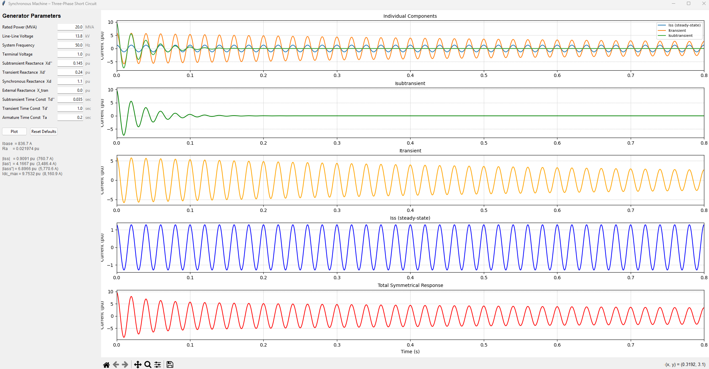

# Generator Short Circuit Current Test Graphing
Basic program to plot synchronous generator response under short circuit test.

## Libraries:
1) numpy
2) math
3) matplotlib
4) tkinter

## Instructions:
Run `SyncMachine_GUI.py` to launch the tkinter GUI. Modify generator parameters in the left panel and click **Plot** to update the graphs.

## Plots:
1) Individual Components (overlay of steady-state, transient, subtransient)
2) Isubtransient
3) Itransient
4) Iss (steady-state)
5) Total Symmetrical Response

Example Output:

